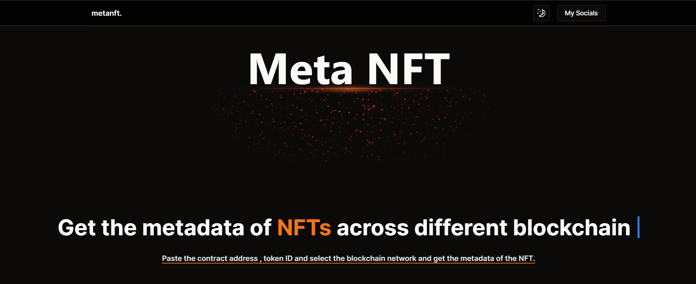

<p align="center">
<a href=https://github.com/codescalper/metanft target="_blank">

</a>
</p>


<p align="center">


</p>

## 📌 Overview

Metanft leverages key dependencies like Next.js, React, TailwindCSS, and various Radix UI components. It also utilizes libraries such as tsParticles, Axios, and Zod for enhanced functionality and user experience.

## 📁 Project Structure

```bash
├── .eslintrc.json
├── .gitignore
├── README.md
├── app
│   ├── favicon.ico
│   ├── globals.css
│   ├── layout.tsx
│   ├── metanft
│   │   └── page.tsx
│   └── page.tsx
├── components.json
├── components
│   ├── Description.tsx
│   ├── Form.tsx
│   ├── Header.tsx
│   ├── MaxWidthWrapper.tsx
│   ├── MoodToggle.tsx
│   ├── Select.tsx
│   ├── theme-provider.tsx
│   └── ui
│       ├── badge.tsx
│       ├── button.tsx
│       ├── card.tsx
│       ├── drawer.tsx
│       ├── dropdown-menu.tsx
│       ├── form.tsx
│       ├── input.tsx
│       ├── label.tsx
│       ├── select.tsx
│       ├── sparkles.tsx
│       └── typewriter-effect.tsx
├── hooks
│   ├── useNetwork.ts
│   └── useResponse.ts
├── lib
│   └── utils.ts
├── next.config.mjs
├── package-lock.json
├── package.json
├── postcss.config.js
├── public
│   ├── next.svg
│   └── vercel.svg
├── tailwind.config.ts
└── tsconfig.json
```

## 📝 Project Summary

- [**app**](app): Main application logic and entry point.
- [**app/metanft**](app/metanft): Specific functionality related to NFT metadata.
- [**components**](components): Reusable UI components for the application.
- [**components/ui**](components/ui): UI-specific components for the application.
- [**hooks**](hooks): Custom React hooks for managing state and logic.
- [**lib**](lib): External libraries or utilities used in the project.
- [**public**](public): Static assets and files served to the client.

## 💻 Stack

- [react-hook-form](https://react-hook-form.com/): Efficient form management library.
- [axios](https://axios-http.com/): HTTP client for data fetching.
- [zustand](https://zustand.surge.sh/): State management solution.
- [next](https://nextjs.org/): React framework for server-side rendering.
- [framer-motion](https://www.framer.com/motion/): Animation library for React.
- [tailwindcss](https://tailwindcss.com/): Utility-first CSS framework.
- [typescript](https://www.typescriptlang.org/): Typed superset of JavaScript.
- [tsparticles/react](https://particles.matteobruni.it/): Particle animations for React.

## 🚀 Run Locally
1.Clone the metanft repository:
```sh
git clone https://github.com/codescalper/metanft
```
2.Install the dependencies with one of the package managers listed below:
```bash
pnpm install
bun install
npm install
yarn install
```
3.Start the development mode:
```bash
pnpm dev
bun dev
npm run dev
yarn dev
```

## 🙌 Contributors
<a href="https://github.com/codescalper/metanft/graphs/contributors">

</a>

## ☁️ Deploy

`[MetaNFT](https://metanft.10xeng.xyz/)`


